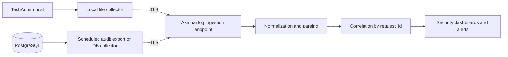

# TechAdmin Logging Pipeline HRA

## 1. Scope

This document describes the logging and audit pipeline after the `dev` branch pull. It covers the Streamlit request path, LangGraph workflow, Loguru application logs, PostgreSQL operation audit records, and the proposed Akamai collection boundary.

The repository currently produces local application logs and database audit records. It does not currently contain an Akamai agent, collector endpoint, SIEM API client, or log-forwarding configuration.

## 2. High-level architecture

```mermaid
flowchart LR
    U[Operator browser] --> S[StreamlitApp/app.py]
    S --> F[FlowService.run_query]
    F --> O[open_request]
    O --> DB[(PostgreSQL audit schema)]
    F --> G[TechAdminWorkflow / LangGraph]
    G --> I[Input guardrails]
    I --> X[Intent and metadata extraction]
    X --> A[Authorization and approval]
    A --> T[Identity tool / MCP / Graph / PowerShell]
    T --> R[Sanitized workflow response]
    R --> C[close_request]
    C --> DB
    C --> E[record_execution]
    E --> DB

    F -. Loguru events .-> L[logs/techadmin.log]
    G -. workflow and guardrail events .-> L
    DB -. DB audit export or collector .-> K[Akamai collector]
    L -. file tail / shipping agent .-> K
    K --> SIEM[Akamai security analytics / SIEM]
```

## 3. Runtime flow

1. The operator submits a request from the Streamlit chat UI.
2. `FlowService.run_query()` creates or reuses the `request_id` and creates a `correlation_id` when required.
3. A first submission calls `open_request()` before the workflow runs. This records `RECEIVED` in `operation_requests`.
4. `TechAdminWorkflow.invoke()` runs the LangGraph orchestration.
5. Guardrails log input, request, approval, and output decisions through `GUARDRAIL_AUDIT` Loguru events.
6. Intent extraction and routing select the permitted identity operation.
7. The selected identity tool executes through the configured backend, such as Microsoft Graph, MCP, or PowerShell.
8. The workflow returns a sanitized response. Plaintext passwords and access tokens must not be placed in the response or audit records.
9. `close_request()` updates `operation_requests` with the final lifecycle state.
10. If a tool actually ran, `record_execution()` adds an `operation_executions` row with status, executor, duration, retry count, and a sanitized result summary.
11. Loguru writes operational events to `logs/techadmin.log` using rotation and retention configured in `App/utils/config.py`.

A confirmation retry reuses the original `request_id`; it does not open a second business request. A blocked request or pending approval updates the request lifecycle but does not create an execution row because no tool ran.

## 4. Log and audit stores

### Application log: `logs/techadmin.log`

Configured by `App.utils.config.Logger.setup()`.

- Format: timestamp, level, module, function, line, message
- Rotation: 500 MB
- Retention: 30 days
- Examples: startup, request received, workflow completed, guardrail decisions, audit write success/failure, tool failures
- Correlation: `request_id` and `correlation_id` are included by the request path where available

### PostgreSQL: `operation_requests`

Answers: **What did the operator ask for, and what lifecycle state did it reach?**

Important fields:

- `request_id`
- `requested_by`
- `source_channel`
- `original_request`
- `operation_id`
- `target_type`
- masked `target_reference`
- sanitized `request_parameters`
- `intent_confidence`
- `status`
- `requested_at` and `completed_at`

### PostgreSQL: `operation_executions`

Answers: **What did the system actually attempt?**

Important fields:

- `execution_id` and parent `request_id`
- `execution_type`: `API`, `SCRIPT`, or `JOB`
- executor name and version
- executor host
- start/end timestamps and duration
- execution status
- HTTP status or process exit code
- external reference ID
- sanitized result summary
- error code/message
- retry count

### PostgreSQL: `operations`

Answers: **Which approved operation catalog entry was selected?**

The catalog contains governance information such as operation code, risk level, and approval requirement.

## 5. Akamai integration boundary

The recommended collection model is:

### Required event fields for Akamai

Every shipped application event should be normalized to these fields:

| Field | Purpose |
|---|---|
| `timestamp` | Event time in UTC |
| `level` | Log severity |
| `event_name` | Stable event taxonomy, such as `UI_QUERY_RECEIVED` |
| `request_id` | End-to-end business request correlation |
| `correlation_id` | Workflow or external-call correlation |
| `source_channel` | `WEB`, `API`, `TEAMS`, or other channel |
| `service` | `techadmin` |
| `environment` | `dev`, `test`, or `prod` |
| `component` | `streamlit`, `workflow`, `guardrail`, `mcp`, `graph`, `powershell`, or `audit` |
| `outcome` | `received`, `blocked`, `awaiting_approval`, `succeeded`, or `failed` |
| `error_type` | Exception class only, where applicable |
| `duration_ms` | Execution duration, where applicable |
| `executor` | Tool or backend name, where applicable |

The `request_id` is the primary join key between the application log, `operation_requests`, and `operation_executions`.

## 6. Security and data handling

The following must never be shipped to Akamai or written to the audit tables:

- temporary or permanent passwords
- access tokens and refresh tokens
- OAuth client secrets
- authorization headers
- database passwords
- full sensitive API payloads

The current audit implementation already masks target identifiers and allowlists request parameters. The Akamai shipper must preserve that policy and must not forward raw request bodies or full tool result payloads.

Recommended Akamai controls:

- use TLS for transport
- authenticate the collector with a managed token or certificate
- restrict outbound traffic to approved Akamai endpoints
- apply a parser that drops secret-like fields before forwarding
- retain immutable `request_id` and event timestamps
- alert on repeated guardrail blocks, audit-write failures, tool failures, and unusual password-reset volume
- monitor collector lag and dropped-event counts

## 7. Event taxonomy

| Event | Producer | Meaning |
|---|---|---|
| `UI_QUERY_RECEIVED` | `FlowService` | Request entered through Streamlit |
| `AUDIT_REQUEST_OPENED` | `operation_audit` | Request row created |
| `GUARDRAIL_AUDIT` | `GuardrailEngine` | Guardrail pass, block, or approval decision |
| `TRUSTED_UI_APPROVAL_APPLIED` | workflow | Operator confirmation was applied |
| `UI_QUERY_COMPLETED` | `FlowService` | Workflow returned a response |
| `UI_QUERY_FAILED` | `FlowService` | Workflow raised an exception |
| `AUDIT_REQUEST_CLOSED` | `operation_audit` | Request lifecycle row finalized |
| `AUDIT_EXECUTION_RECORDED` | `operation_audit` | Actual tool attempt persisted |
| `AUDIT_*_FAILED` | audit layer | Audit persistence failed; business flow remains fail-safe |

## 8. Current gaps before production Akamai onboarding

1. `logs/techadmin.log` is plain text rather than a dedicated JSON event stream.
2. No Akamai endpoint, authentication, parser, or shipper configuration is present in the repository.
3. Loguru setup is explicitly initialized by `App.main`; the Streamlit entrypoint should use one shared logging bootstrap before production deployment.
4. Database audit export to Akamai is not implemented; it requires an approved polling, CDC, or database-collector design.
5. The deployed service needs environment metadata such as `environment`, `service`, and `host` added consistently to shipped events.

## 9. Recommended implementation sequence

1. Confirm Akamai ingestion protocol, endpoint, certificate/token requirements, and retention policy.
2. Add a dedicated structured JSONL sink for security events while retaining the human-readable local log.
3. Centralize Loguru setup so FastAPI and Streamlit configure the same sinks exactly once.
4. Configure the host collector to ship only the structured security log over TLS.
5. Select a PostgreSQL audit export method and ship only sanitized rows from the three audit tables.
6. Build Akamai parsing and correlation around `request_id` and `correlation_id`.
7. Test blocked, approved, failed, retried, and database-outage scenarios before production enablement.
